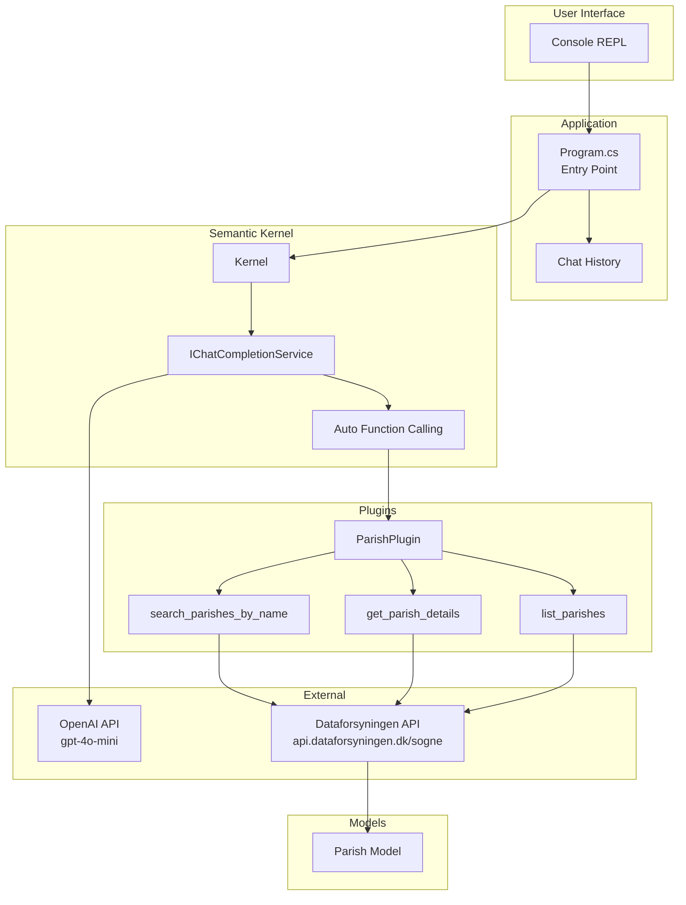
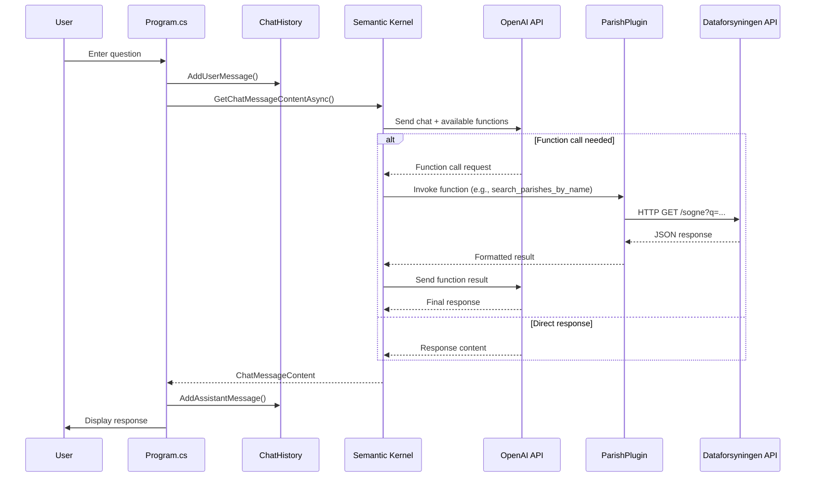
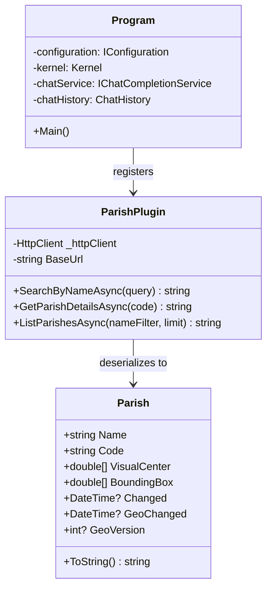

# CLAUDE.md

This file provides guidance to Claude Code (claude.ai/code) when working with code in this repository.

## Build Commands

```bash
# First-time setup (copies template and restores dependencies)
./setup.sh    # Linux/Mac
setup.bat     # Windows

# Or manually:
dotnet restore
dotnet build
dotnet run
```

## Setup for New Developers

1. Run `./setup.sh` (Linux/Mac) or `setup.bat` (Windows)
2. Edit `appsettings.json` and add your OpenAI API key
3. Run `dotnet run`

## Project Overview

SogneAgent is a Danish Parish (Sogn) Information Agent built with .NET 8.0 and Microsoft Semantic Kernel. It provides an interactive chatbot that queries the Dataforsyningen API for Danish parish data.

## Architecture

The project uses Semantic Kernel's plugin-based architecture for LLM function calling:

- **Program.cs** - Entry point, initializes Semantic Kernel with OpenAI, registers plugins, runs the chat REPL loop
- **Models/Parish.cs** - Data model mapping JSON from Dataforsyningen API (Danish field names like `navn`, `kode`, `visueltcenter`)
- **Plugins/ParishPlugin.cs** - Semantic Kernel plugin exposing three functions:
  - `search_parishes_by_name()` - Search by name/partial name
  - `get_parish_details()` - Get details by parish code
  - `list_parishes()` - List parishes with optional filtering

API base URL: `https://api.dataforsyningen.dk/sogne`

## Configuration

OpenAI settings are loaded from `appsettings.json` (gitignored) or environment variable `OPENAI_API_KEY`. Use `appsettings.template.json` as reference:

```json
{
  "OpenAI": {
    "ApiKey": "YOUR_OPENAI_API_KEY_HERE",
    "ModelId": "gpt-4o-mini"
  }
}
```

## Key Dependencies

- Microsoft.SemanticKernel (v1.29.0) - AI orchestration with automatic function calling
- Microsoft.Extensions.Configuration - JSON and environment variable configuration

## Architecture Diagrams

### High-Level Architecture



### Chat Flow Sequence



### Class Structure


