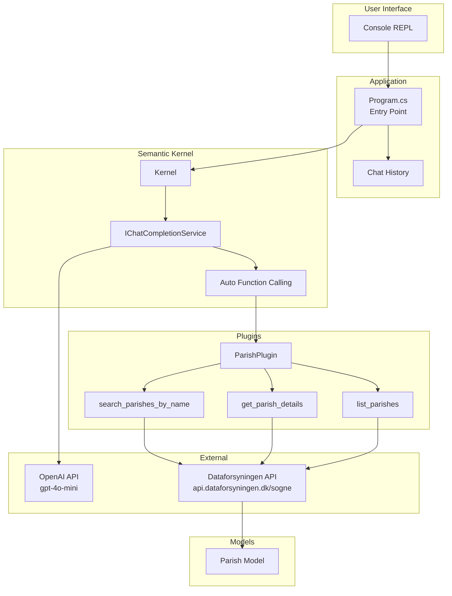
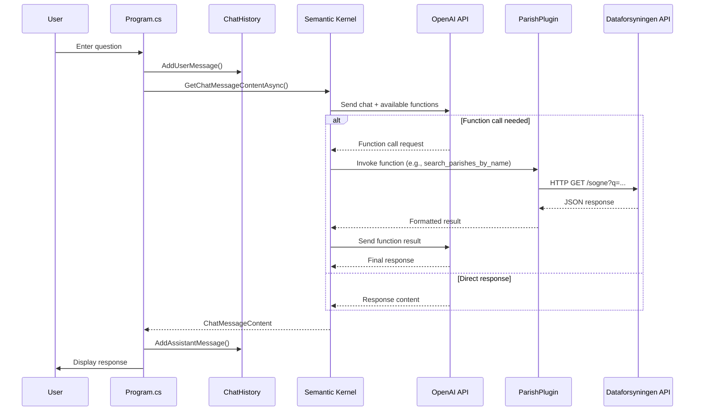
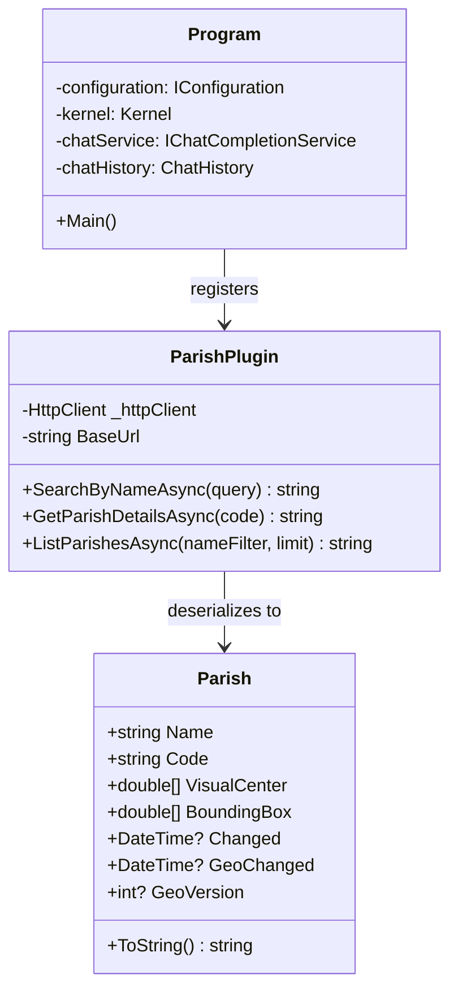

# CLAUDE.md

This file provides guidance to Claude Code (claude.ai/code) when working with code in this repository.

## Build Commands

```bash
dotnet restore
dotnet build
dotnet run
```

## Architecture

Semantic Kernel plugin-based architecture with automatic LLM function calling:

- **Program.cs** - Entry point, initializes Kernel with OpenAI, registers plugins, runs chat REPL
- **Models/Parish.cs** - Data model mapping Danish JSON fields (`navn`, `kode`, `visueltcenter`)
- **Plugins/ParishPlugin.cs** - Three kernel functions:
  - `search_parishes_by_name(query)` - Search by name/partial name
  - `get_parish_details(code)` - Get details by parish code
  - `list_parishes(nameFilter?, limit?)` - List with optional filtering

External API: `https://api.dataforsyningen.dk/sogne`

## Key Dependencies

- Microsoft.SemanticKernel (v1.29.0) - AI orchestration with auto function calling
- Microsoft.Extensions.Configuration - Config from appsettings.json and environment variables

## Architecture Diagrams

### High-Level Architecture



### Chat Flow Sequence



### Class Structure


